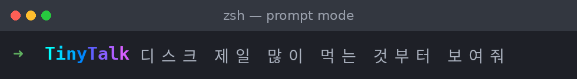

<div align="center">

# TinyTalk

[English](README.md) · **[한국어](README.ko.md)**


**자연어를 셸 명령으로. 실행 여부는 언제나 사용자가 정합니다.**

셸에 하고 싶은 일을 한국어로 적으면, TinyTalk이 바로 실행할 수 있는 명령으로 바꿉니다. 내
컴퓨터에 실제로 깔린 도구를 기준으로 확인하고, 한 줄 설명과 함께 입력창에 넣습니다. 명령을 대신
실행하지는 않습니다. 그 판단은 늘 사용자 몫입니다. 클라우드 모델이든, 노트북에서 혼자 도는
로컬 모델이든 똑같이 씁니다.

</div>

```
? 디스크 제일 많이 먹는 것부터 보여줘

du -h -d1 / 2>/dev/null | sort -hr | head -20
↳ 상위 디렉터리 디스크 사용량, 큰 순서대로
```

빈 줄에서 `?`를 누르고 원하는 걸 적으면, 입력창이 명령과 한 줄 설명으로 바뀝니다. 고쳐서
실행하거나, 그대로 실행하거나, 무시하면 됩니다.

- **추측하지 않고 검증합니다.** 요청을 시스템 스냅샷(설치된 바이너리, OS, 셸)에 대조합니다.
  그래서 Mac에서 `apt`가 나오거나, `find`가 지원하지 않는 플래그가 붙는 일이 없습니다.
- **직접 실행하지 않습니다.** 명령을 보여 줄 뿐, 실행은 사용자가 합니다. 위험한 명령은 주석
  처리해서 돌려주므로, 실수로 Enter를 눌러도 그대로 실행되지 않습니다.
- **모델은 자유롭게 고릅니다.** 구독(Claude, Codex), 클라우드 API(Bedrock, Azure), 오프라인
  로컬 모델을 모두 지원합니다. 쓰는 방식은 같고, 설정 한 줄만 바꾸면 전환됩니다.

---

## 목차

- [시작하기](#시작하기)
- [클라우드 모델 사용하기](#클라우드-모델-사용하기)
- [로컬 모델 사용하기](#로컬-모델-사용하기)
- [설정하기](#설정하기)
- [기능 설명](#기능-설명)
- [벤치마크](#벤치마크)

---

## 시작하기

### 설치

명령 한 줄입니다. `tt`는 단독 실행 바이너리로 배포됩니다. Python도, uv도, 빌드도 필요 없습니다.

```sh
curl --proto '=https' --tlsv1.2 -LsSf https://raw.githubusercontent.com/pbkimdev/tinytalk/main/scripts/install.sh | sh
```

설치 스크립트가 내 플랫폼(macOS·Linux, arm64·x86_64)에 맞는 바이너리를 내려받습니다. 설치와
설정만 합니다. 생성한 명령을 대신 실행하지 않고, 셸 설정도 물어보지 않고는 건드리지
않습니다. Bedrock에 필요한 boto3/botocore도 이 바이너리에 처음부터 포함됩니다. 한 번 실행하면
다음을 처리합니다.

1. `tt` 바이너리를 내려받아 `~/.local/bin`에 둡니다.
2. 동의를 받아 그 경로를 `PATH`에 추가합니다.
3. `~/.config/tinytalk/config.toml`이 없을 때만 스타터 설정을 만듭니다.
4. 첫 요청이 바로 뜨도록 grounding 스냅샷을 미리 만들어 둡니다.
5. **`tt setup`** 으로 넘겨줍니다 — 언어를 먼저 고르면(이후 마법사도 그 언어로
   진행됩니다) `?` 위젯의 `~/.zshrc` 연결, 모델 프로바이더를 단계별로 묻는 대화형
   마법사입니다. 모든 단계는 먼저 물어보고, 건너뛸 수 있으며, `tt setup`을 다시
   실행하면 언제든 답을 바꿀 수 있습니다(이미 설정된 항목은 표시됩니다).


설치 스크립트가 추가한 것 전부(바이너리, 설정, 캐시, 키체인 항목, rc 블록)를 제거하려면
— 각 제거도 먼저 물어봅니다:

```sh
curl --proto '=https' --tlsv1.2 -LsSf https://raw.githubusercontent.com/pbkimdev/tinytalk/main/scripts/uninstall.sh | sh
```

`--yes`를 붙이면 모든 확인을 자동으로 넘기고(스크립트·CI용), `--no-rc`를 붙이면 셸 설정을
건드리지 않으며, 릴리스를 고정할 수 있습니다:

```sh
# 환경 변수 — curl | sh 만으로 동작
TT_VERSION=v0.2.0rc4 curl --proto '=https' --tlsv1.2 -LsSf .../scripts/install.sh | sh

# 플래그 — 파이프 설치 시 -s 필요 (-s 없이 --version 을 쓰면 sh 가 파일명으로 해석함)
curl --proto '=https' --tlsv1.2 -LsSf .../scripts/install.sh | sh -s -- --version v0.2.0rc4
```

대화형 `?` 프롬프트는 **zsh** 위젯이라 zsh를 권장합니다. macOS는 기본 셸이고, Linux에서도
`apt install zsh` 한 번이면 됩니다. `tt "..."`로 직접 부르는 명령은 bash를 포함한 모든 셸에서
동작합니다. 소스에서 빌드하려면 리포지터리를 클론해 `uv tool install .`을 실행하면 됩니다.

### 첫 실행

위젯이 로드되도록 새 셸을 연 뒤 빈 줄에서 `?`를 누릅니다. 작은 `TinyTalk` 배지가 켜지면
**프롬프트 모드**입니다. 원하는 걸 한국어나 영어로 적고 Enter를 누릅니다.



잠깐 뒤 그 줄이 실제 명령으로 바뀌고, 아래에 한 줄 설명이 붙습니다. 읽어 보고, 필요하면
고치고, 직접 실행합니다.


설치 때 마법사를 건너뛰었다면 `tt setup`이 전부(위젯, 백엔드, 언어)를 안내합니다.
백엔드만 다루려면 `tt auth`를 쓰세요 — 클라우드 API나 로컬 OpenAI 호환 서버 중 하나가
연결되어 있어야 답을 받을 수 있습니다. 연결 확인은 `tt "list files by size"`가 가장
빠릅니다.

---

## 클라우드 모델 사용하기

백엔드 설정은 `tt auth`입니다(`tt setup`의 2단계이기도 합니다). 프로바이더를 고르면 그
방식대로 인증하고, 실제 호출 한 번으로 자격 증명을 확인한 뒤, 검증한 백엔드를 설정 파일에
기록합니다. 프로바이더 자체 로그인과 AWS 자격 증명은 원래 설정한 곳에 그대로 둡니다. TinyTalk이
직접 받는 API 키만 설정 파일이 아닌 OS 키체인에 저장하며, 사용자가 확인하기 전에는 아무것도
저장하지 않습니다.


TinyTalk이 관리하는 **슬롯**은 둘입니다. 먼저 묻는 **primary**, primary가 막히면 쓰는
**fallback**입니다(선택). 아래에서 가장 흔한 클라우드 백엔드 세 가지를 설정합니다. 구독이 있으면
구독을, 종량제 API 예시로는 AWS Bedrock을 씁니다.

### Claude — 구독으로

Claude Code를 쓰고 있다면 TinyTalk이 그 로그인을 그대로 사용합니다. API 키도, 따로 나가는
요금도 없습니다. 먼저 로그인 상태를 확인합니다.

```sh
claude      # TUI에서 /login, 또는:
claude setup-token   # 1년짜리 토큰 출력 → export CLAUDE_CODE_OAUTH_TOKEN=...
```

그다음 `tt auth`에서 **Claude Agent SDK**를 고르고 모델을 정합니다. 여기서는 비밀값을 묻지
않습니다. 이미 해 둔 `claude` 로그인을 쓰기 때문입니다. 콘솔 키를 쓰려면 `ANTHROPIC_API_KEY`도
됩니다.


그러면 이런 백엔드가 기록됩니다.

```toml
[defaults]
backend = "claude"

[backends.claude]
kind = "claude-agent-sdk"
model = "claude-sonnet-5"
effort = "low"
```

### Codex — ChatGPT 요금제로

방식은 같고, GPT 버전입니다. Codex CLI를 ChatGPT 요금제로 로그인합니다.

```sh
codex login     # ChatGPT OAuth 화면이 브라우저로 열립니다
```

그다음 `tt auth` → **OpenAI Codex Agent SDK** → 모델 선택. TinyTalk은 로컬 Codex 로그인을 쓸
뿐, 별도로 저장하는 값은 없습니다.

```toml
[backends.codex]
kind = "codex-agent-sdk"
model = "gpt-5.5"
effort = "low"
```

### Bedrock — 종량제 API

종량제 클라우드 모델의 예시로 AWS Bedrock을 다룹니다. AWS 콘솔에서 먼저 두 가지를 준비합니다.

1. **모델 액세스 활성화.** Bedrock → *Model access*에서 원하는 Anthropic 모델의 액세스를
   신청합니다. (2026년 초부터는 대부분 자동으로 열리지만, 최초 사용 동의 폼이 뜰 수 있습니다.)
2. **자격 증명 준비.** `aws configure`(또는 `aws sso login`, named profile)면 됩니다. TinyTalk은
   boto3의 표준 자격 증명 체인을 그대로 사용합니다.

Claude Code가 사용자 설정 `~/.claude/settings.json`으로 이미 Bedrock을 쓰고 있다면 `tt auth` →
**AWS Bedrock**에서 인증 설정을 재사용할 수 있습니다. 기본 경로는 `AWS_REGION`과 선택 항목인
`AWS_PROFILE`만 사용한 뒤, 활성 Claude 추론 프로파일과 텍스트 기반 모델 목록을 보여 줍니다.
Claude가 아닌 Bedrock 모델은 제외하며 AWS에서 제공하는 Sonnet 5와 Opus 4.8 ID가 이 목록에
나타납니다. Claude Code의 현재 Opus 모델을 자동 선택하지 않고 사용자가 직접 고릅니다. 기존 모델을
그대로 재사용하는 경로도 별도 선택으로 남아 있습니다. AWS 키, 전달자 토큰, 자격 증명 내보내기 값은
복사하지 않으며 Claude Code의 `awsAuthRefresh`/`awsCredentialExport` 명령도 실행하지 않습니다.
선택한 모델은 TinyTalk이 실제로 쓰는 Bedrock **Converse** 경로로 과금되는 최소 요청을 한 번 보내
검증합니다.

Claude Code 모델 끝의 `[1m]`은 확장 컨텍스트 옵션입니다. TinyTalk은 아직 이 옵션을 유지하지
못하므로, 같은 모델의 표준 컨텍스트 윈도우를 써도 되는지 별도로 확인합니다. Application inference
profile ARN과 Claude Code 사용자 지정 엔드포인트는 모델 종류나 Invoke/Converse 호환성을 안전하게
판단할 수 없어 자동으로 가져오지 않습니다. 이 경우에도 직접 설정은 가능합니다.

재사용할 설정이 없거나 직접 설정을 고르면 runtime 엔드포인트(선택), 리전, 프로파일(선택)을 묻고
모델을 찾아 선택하게 합니다. 조직 정책이 모델 카탈로그 조회를 막으면 모델 id를 직접 입력할 수
있습니다. 자격 증명은 계속 boto3 표준 체인에서만 가져오며 TinyTalk은 AWS 액세스 키 쌍을 묻지
않습니다. 이름 있는 프로파일의 SSO 세션이 만료되면 TinyTalk이 같은 터미널에서
`aws sso login --profile <profile>`을 시작합니다. AWS CLI가 브라우저를 자동으로 열고, 열리지 않을
경우 사용할 인증 URL도 터미널에 표시합니다. 로그인이 끝나면 TinyTalk이 Bedrock 검증을 자동으로
이어갑니다. 릴리스 바이너리, Python 소스 설치, `uv tool install .` 모두 boto3를 기본으로 포함하므로
Bedrock 추가 구성 요소를 별도로 내려받지 않습니다.

Claude의 reasoning effort는 모델 세대에 맞게 전달합니다. Opus 4.8 같은 신형 모델에는 Bedrock의
adaptive thinking effort를 사용하고, 구형 extended-thinking 모델에는 비스트리밍 제한 안의 토큰
budget을 사용합니다. Thinking 요청에서는 Bedrock 제약에 맞춰 tool 선택을 auto로 두고 호환되지
않는 sampling 파라미터를 제외합니다. 명시한 출력 토큰 상한이 legacy thinking을 수용할 수 없거나
Bedrock의 비스트리밍 thinking 제한을 넘으면 그 상한을 몰래 늘리지 않고 그대로 유지한 채 일반
생성으로 전환합니다.


```toml
[backends.bedrock]
kind = "bedrock"
model = "us.anthropic.claude-sonnet-5-v1:0"   # 예시. tt auth가 찾아준 id를 쓰세요
aws_region = "us-east-1"
```

> Bedrock은 온디맨드 사용 시 대부분의 모델을 **추론 프로파일**로 제공합니다. 맨 모델 ID가
> 거부되면 `tt auth`가 찾아 준 프로파일 id를 씁니다. 보통 `us.`, `global.` 같은 리전 접두사가
> 붙습니다.

### 전환과 폴백

primary와 fallback을 한 설정에 함께 둘 수 있습니다. 평소에는 로컬 모델을 쓰다가, 막힐 때만
클라우드로 넘어가도록 구성합니다.

```toml
[defaults]
backend = "local"              # primary 슬롯
escalation_backend = "claude"  # fallback 슬롯
```

`tt auth`를 다시 실행하면 fallback을 새로 잡거나, 슬롯을 바꾸거나, 제거할 수 있습니다.

---

## 로컬 모델 사용하기

클라우드도, API 키도, 밖으로 나가는 데이터도 없습니다. TinyTalk은 OpenAI 호환 HTTP API를 하는
로컬 서버라면 무엇이든 연결합니다. 여기서 다룰 서버는 macOS의 **oMLX**(Apple MLX 기반)와 Linux의
**llama.cpp** 둘입니다. 내 컴퓨터에 맞는 쪽을 고릅니다.

### 모델 고르는 기준

이 작업은 문장 하나를 명령 하나로 바꾸는 것뿐이라 최전선(frontier) 모델까지는 필요 없습니다.
고를 때 볼 점은 네 가지 정도입니다.

- **활성 파라미터 대 전체 파라미터.** Mixture-of-Experts(MoE) 모델은 숫자를 둘 적습니다. 예를
  들어 *26B-A4B*는 전체 26B지만 토큰마다 켜지는 건 약 4B입니다. 작은 모델의 속도로 큰 모델의
  지식을 쓰는 구조라 이 작업에 잘 맞습니다.
- **양자화(Quantization).** 4비트·8비트 가중치는 품질을 조금 내주는 대신 메모리를 크게 아낍니다.
  QAT(Quantization-Aware Training) 빌드는 그 손실을 대부분 회복합니다.
- **메모리.** 양자화한 가중치가 RAM(Apple Silicon은 통합 메모리)이나 VRAM에 들어가야 하고, KV
  캐시 몫도 남겨야 합니다.
- **툴 콜링·구조화 출력.** 있으면 좋지만 필수는 아닙니다. TinyTalk은 어떤 서버에서든 범용
  fenced JSON 방식으로 물러설 수 있어서, 이 기능이 없는 모델도 잘 돕니다.

예시로는 **구글의 Gemma 4 26B-A4B**를 씁니다. [벤치마크](#벤치마크)에서 쓴 MoE 빌드입니다.
토큰마다 약 4B만 켜지므로 빠르고, 양자화 빌드는 요즘 노트북에 넉넉히 들어가며(QAT Q4 기준 약
15GB), 평가 성적도 준수합니다.

### macOS — oMLX

[oMLX](https://github.com/jundot/omlx)는 Apple Silicon 전용 추론 서버(OpenAI·Anthropic 호환)이며
메뉴바 앱도 있습니다. CLI는 Homebrew로 설치합니다.

```sh
brew tap jundot/omlx https://github.com/jundot/omlx
brew install omlx
```

Gemma 4 MLX 빌드를 모델 폴더로 받습니다. oMLX 어드민 대시보드(`http://localhost:8000/admin`)에서
받거나, Hugging Face에서 바로 받습니다.

```sh
mkdir -p ~/models
hf download unsloth/gemma-4-26b-a4b-it-MLX-8bit \
  --local-dir ~/models/gemma-4-26B-A4B-it-MLX-8bit
```

서버를 실행합니다. oMLX가 폴더에서 모델을 자동으로 찾아 `http://localhost:8000/v1`에 띄웁니다.

```sh
omlx serve --model-dir ~/models
```

로그인할 때마다 자동으로 뜨게 하려면 **데몬으로 실행**합니다. Homebrew 서비스 매니저가 처리하고,
크래시가 나면 자동으로 재시작합니다.

```sh
brew services start omlx     # 지금, 그리고 로그인할 때마다 시작
brew services info omlx      # 상태 확인
```

서비스는 기본값으로 `~/.omlx/models`를 `8000` 포트에 띄웁니다. `OMLX_MODEL_DIR`, `OMLX_PORT`를
바꾸거나 `omlx serve --model-dir …`를 한 번 실행해 설정을 저장하면 바뀝니다.

### Linux — llama.cpp

[llama.cpp](https://github.com/ggml-org/llama.cpp)는 로컬 LLM 생태계 상당수를 떠받치는 C/C++
엔진입니다. GGUF 가중치를 읽고, `llama-server`가 OpenAI API를 제공합니다. 설치는 Homebrew가 가장
간단하고(Linux에서도 됩니다), 아니면 소스에서 빌드합니다.

```sh
brew install llama.cpp
# 또는 소스에서:
#   git clone https://github.com/ggml-org/llama.cpp && cd llama.cpp
#   cmake -B build && cmake --build build -j --config Release
```

`llama-server`는 `-hf`로 GGUF를 Hugging Face에서 바로 내려받습니다. Gemma 4 26B-A4B GGUF(QAT
`Q4_K_M` 빌드 권장)를 지정해 8080 포트에 띄웁니다.

```sh
llama-server -hf unsloth/gemma-4-26b-a4b-it-GGUF:Q4_K_M --port 8080 -c 8192
```

OpenAI 호환 엔드포인트가 `http://localhost:8080/v1`에 열립니다.

**데몬으로 실행**하려면 systemd *user* 서비스를 씁니다. `~/.config/systemd/user/llama-server.service`를
만듭니다.

```ini
[Unit]
Description=llama.cpp server
After=network-online.target

[Service]
ExecStart=%h/.local/bin/llama-server -hf unsloth/gemma-4-26b-a4b-it-GGUF:Q4_K_M --port 8080 -c 8192
Restart=on-failure

[Install]
WantedBy=default.target
```

그리고 활성화합니다. 로그인하지 않아도 부팅 때 뜨도록 `enable-linger`까지 설정합니다.

```sh
systemctl --user daemon-reload
systemctl --user enable --now llama-server
sudo loginctl enable-linger "$USER"
```

### TinyTalk을 로컬 서버에 연결

키가 필요 없는 로컬 서버는 `tt auth`도 필요 없습니다. `base_url`만 맞춘 `openai-compat` 백엔드면
됩니다. 설치 스크립트가 이미 하나 만들어 두므로, 서버에 맞게 고칩니다.

```toml
[defaults]
backend = "local"

[backends.local]
kind = "openai-compat"
base_url = "http://localhost:8000/v1"    # llama.cpp는 8080
model = "gemma-4-26B-A4B-it-MLX-8bit"
```

모델이 보이는지 확인하고(`curl -s localhost:8000/v1/models`) 실행해 봅니다. 아래는 로컬 모델이
간단한 날씨 원라이너를 만든 결과입니다.


돌려받은 명령을 실행하면 요청한 형태로 출력됩니다.


TinyTalk이 모델에 넘기는 grounding은 언제든 확인할 수 있습니다.


---

## 설정하기

설정은 모두 `~/.config/tinytalk/config.toml`에 있습니다(`--config`나 `TT_CONFIG`로 바꿉니다).
설정이 없거나 잘못되면 무엇을 고쳐야 하는지 알려 주고 멈춥니다. 기능을 모두 쓴 예시입니다.

```toml
[defaults]
backend = "local"                # primary 슬롯
escalation_backend = "claude"    # fallback 슬롯 (선택)
posture = "hybrid"               # 선언용 태도: local | hybrid | cloud
language = "ko"                  # 설명 언어; 비워 두면 로케일에서 자동 감지

[backends.local]
kind = "openai-compat"
base_url = "http://localhost:8000/v1"
model = "gemma-4-26B-A4B-it-MLX-8bit"

[backends.claude]
kind = "claude-agent-sdk"
model = "claude-sonnet-5"
effort = "low"                   # 추론 강도: none|minimal|low|medium|high|xhigh|max

[cache]
enabled = true                   # 지난 프롬프트 정확 일치 캐시

[prices."gemma-4-26B-A4B-it-MLX-8bit"]
input_per_mtok = 0.06            # 선택. history·eval 비용 칸에 씀
output_per_mtok = 0.33
```

**백엔드**는 `[backends.<name>]` 테이블 하나입니다. `kind`(와이어 프로토콜)에 모델과 자격 증명을
더한 것입니다. 쓸 수 있는 kind는 다음과 같습니다.

| `kind` | 설명 |
|---|---|
| `openai-compat` | OpenAI 호환 HTTP API 전부. 로컬(oMLX, llama.cpp, Ollama)이든 호스팅이든 |
| `anthropic-compat` | Anthropic Messages API를 raw HTTP로 |
| `claude-agent-sdk` | Agent SDK로 쓰는 Claude (Claude Code 로그인 또는 `ANTHROPIC_API_KEY`) |
| `codex-agent-sdk` | Codex CLI 로그인으로 쓰는 GPT |
| `bedrock` | AWS Bedrock (AWS 자격 증명 체인 사용, boto3 포함) |
| `azure-openai` | Azure OpenAI (엔드포인트 + API 키 + deployment) |

알아 두면 좋은 키 몇 개입니다. `api_key_env`는 환경 변수에서, `keyring_account`는 OS 키체인에서
비밀값을 읽습니다(`tt auth`가 API 키를 직접 받는 프로바이더에만 설정합니다). `capabilities`는
백엔드에 더 좋은 응답 형식(`tool_calling`, `native_json`, `grammar`)을 허용합니다. `effort`는
프로바이더가 지원하면
추론 강도를 넘깁니다. **설명 언어**(`language`)는 한 줄 설명에만 적용됩니다. 명령 자체와 TinyTalk의
자체 메시지는 영어 그대로입니다.

---

## 기능 설명

**프롬프트 모드와 배지.** 빈 줄에서 `?`를 누르면 프롬프트 모드가 켜지고 꺼집니다. 타이핑하는
동안과 TinyTalk이 응답을 기다리는 동안, 배지 글자 사이로 스펙트럼 물결이 흐릅니다. 빈 줄에서
`?`나 Backspace로 빠져나옵니다. 모드를 켜고 끄는 `?`는 글자로 입력되지 않습니다.

**Grounding과 검증.** 요청을 보내기 전에 시스템 스냅샷(설치된 바이너리와 핵심 플래그, OS, 셸)을
모아 모델에 전달하고, 같은 스냅샷으로 응답을 검증합니다. 없는 바이너리를 부르거나 파싱되지 않는
명령은 보여 주지 않고 걸러냅니다.

**위험도 표시.** 제안마다 `safe`·`caution`·`destructive` 등급을 매깁니다. 위젯에서는 위험한
명령을 **주석 처리한 채로** 넣습니다. 실행하려면 `#`을 직접 지워야 하므로, 키 한 번으로 사고가
나지 않습니다.

**명령 하나, 메뉴 없음.** 모델은 답 하나에 확정합니다. "세 가지 옵션이 있습니다" 같은 식이
아닙니다. 유효한 답을 만들지 못하면, 지어내지 않고 실패로 처리합니다.

**티어와 에스컬레이션, 캐시.** 같은 프롬프트는 정확 일치 캐시에서 비용 없이 나옵니다. primary
백엔드가 유효한 명령을 만들지 못하면 fallback으로 넘기고, 각 티어는 자기 요율로 계산합니다.

**히스토리와 리콜.** 프롬프트→명령 결과를 모두 기록합니다(`XDG_STATE_HOME` 아래 날짜별 JSONL).
`tt history`로 확인하며, fzf가 있으면 fzf 피커로, 없으면 평문 목록으로 보여 줍니다. 프롬프트
모드 안에서는 ↑/↓로 지난 명령을 입력창에 불러옵니다.

**비용 없이 확인하기.** `tt prompt "<요청>"`은 TinyTalk이 보낼 시스템·유저 프롬프트를 그대로
출력합니다. 모델을 호출하지 않으므로 비용도 없습니다.


**스크립트 연동 출력.** `tt --json`은 구조화된 제안 전체를 출력해 다른 도구에 파이프로 연결하기
좋고, `tt --widget`은 zsh 통합이 그대로 실행하는 셸 형식(shell-evalable)을 출력합니다.


---

## 벤치마크

TinyTalk에는 자체 평가 스위트가 있습니다. `tt eval`은 자연어 명령 묶음을 설정된 모든 백엔드에
영어·한국어로 실행해, 결과가 실제로 **파싱**되는지, **진짜 바이너리**를 부르는지, **검증
조건(assertion)**을 통과하는지 채점합니다. 실행할 명령을 건네는 도구에 꼭 필요한 지표입니다.
로컬 모델도 호스팅 모델과 함께 돌려서, 완전히 오프라인으로 갔을 때 무엇을 포기하는지 바로
비교할 수 있습니다.


최신 공개 실행: **2026-07-03** ([`docs/bench/2026-07-03/`](docs/bench/2026-07-03/)).


전체 인터랙티브 리포트는 [`docs/bench/2026-07-03/index.html`](docs/bench/2026-07-03/index.html)에,
재현·게시 방법은 [`docs/bench/RUNBOOK.md`](docs/bench/RUNBOOK.md)에 있습니다. 어려운 25타깃
스위트에서 최전선 모델(Sonnet 5, GPT-5.5)이 98% 언저리로 가장 높고, 로컬 **Gemma 4 26B-A4B가
94%**를 기록합니다. 응답 속도는 이 중에서 가장 빠릅니다(중앙값 약 1.6초). 한 번 도는 비용은
1센트 남짓입니다.

### 짚고 넘어갈 점

벤치마크는 참고용입니다. 숫자를 인용하기 전에 몇 가지를 알아 두면 좋습니다.

- **로컬 비용은 청구액이 아니라 환산값입니다.** 로컬 모델은 내 컴퓨터에서 한계비용이 거의
  0입니다. 달러 숫자는 호스팅 프록시의 정가로, 모든 모델을 한 축에 올려 비교하려고 붙인
  값입니다.
- **SDK 오버헤드를 포함했습니다.** Claude·Codex 백엔드는 각자의 agent SDK로 돌기 때문에, 매
  요청이 CLI 자체의 시스템 컨텍스트(입력 토큰 수만 개)와 시작 지연을 함께 짊어집니다. 해당
  백엔드에서 출시된 그대로의 TinyTalk이 실제로 치르는 비용이라 포함했습니다. 다만 맨 API 호출과
  비교하면 토큰 수와 지연이 커 보입니다.
- **일부 수치는 변동이 있습니다.** speculative decoding을 쓰는 로컬 빌드는 온도 0에서도 몇
  프롬프트가 실행마다 달라지고(± 몇 점), 캐시 토큰을 보고하지 않습니다. 토크나이저도 서로 달라
  Sonnet은 같은 글에 토큰을 약 30% 더 셉니다. 작은 차이는 오차로 봅니다.
- **"strict pass"는 좁게 정의했습니다.** 어떤 행은 전송 에러가 있어도 strict pass가 될 수
  있습니다. 통과 여부를 처음부터 끝까지 정상 실행한 결과가 아니라, 돌려받은 명령의 파싱·바이너리·
  assertion만으로 다시 채점하기 때문입니다.

정리하면, 이 작업에서 로컬 모델은 충분히 실용적이고 모델 간 차이도 분명합니다. 소수점
아랫자리에는 큰 의미를 두지 않아도 됩니다.
