<div align="center">

# TinyTalk

**[English](README.md)** · [한국어](README.ko.md)

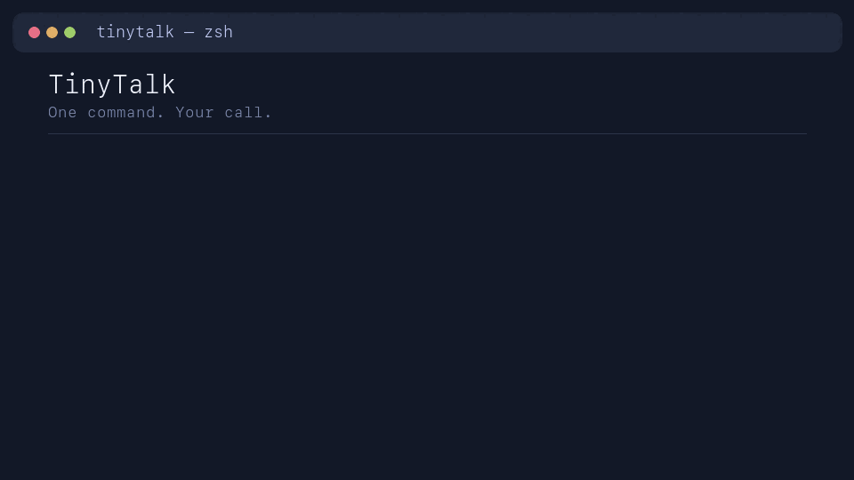

**Type what you want. Read the command it hands back. Hit Enter — or don't.**

TinyTalk turns plain English at your shell prompt into a real, runnable command —
checked against the tools you actually have, explained in one line, and dropped
straight into your buffer. It never runs anything on its own; you always get the
last look. Works against a cloud model or one running entirely on your own machine.

</div>

```
? show me what's eating my disk, biggest first

du -h -d1 / 2>/dev/null | sort -hr | head -20
↳ top-level disk usage, largest first
```

Press `?` on an empty line, describe the thing, and TinyTalk swaps your buffer for a
command plus a one-line explanation. Edit it, run it, or ignore it. That's the whole
product — a translator that stops at the edge of your keyboard and lets you decide.

- **Grounded, not guessed.** Every request is checked against a snapshot of your box —
  the binaries you have, your OS, your shell — so you don't get `apt` on a Mac or a
  flag your `find` doesn't support.
- **Hands off the trigger.** TinyTalk prints; you run. Destructive commands come back
  commented out so an errant Enter can't wipe anything.
- **Your model, your call.** A subscription (Claude, Codex), a cloud API (Bedrock,
  Azure), or a model running fully offline on your laptop — same interface, swap by
  editing one line.

---

## Table of contents

- [Getting started](#getting-started)
- [Using a cloud model](#using-a-cloud-model)
- [Using a local model](#using-a-local-model)
- [Configuration](#configuration)
- [Features](#features)
- [Benchmark](#benchmark)

---

## Getting started

### Install

One command. `tt` ships as a self-contained binary — no Python, no uv, nothing to build:

```sh
curl --proto '=https' --tlsv1.2 -LsSf https://raw.githubusercontent.com/pbkimdev/tinytalk/main/install.sh | sh
```

The installer downloads the binary for your platform (macOS and Linux, arm64 or x86_64),
and it installs and configures only — it never runs a generated command, and never edits
your shell config without asking. In one pass it:

1. downloads the `tt` binary and drops it in `~/.local/bin`,
2. adds that to your `PATH` (with your consent),
3. writes a starter `~/.config/tinytalk/config.toml` — only if one doesn't exist,
4. warms the grounding snapshot so your first request is instant, and
5. wires the `?` widget into `~/.zshrc` (with your consent).

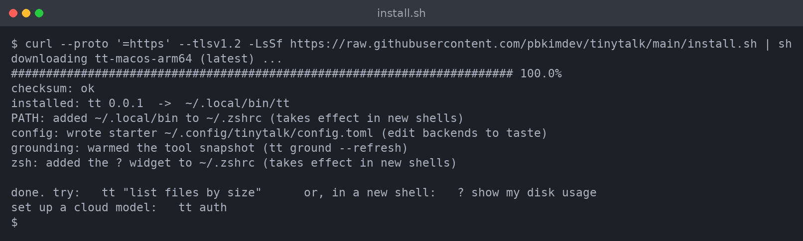

Pass `--yes` to accept every prompt (handy for scripts/CI), `--no-rc` to leave your shell
config untouched, or `--version <tag>` to pin a release.

The interactive `?` prompt is a **zsh** widget, so zsh is recommended — it's the default
shell on macOS, and one `apt install zsh` away on Linux. The plain `tt "..."` command works
in any shell, including bash. Prefer to build from source? Clone the repo and run
`uv tool install .` instead.

### First run

Open a new shell so the widget loads, then press `?` on an empty line. A small
`TinyTalk` badge lights up — you're in **prompt mode**. Type what you want and hit Enter.

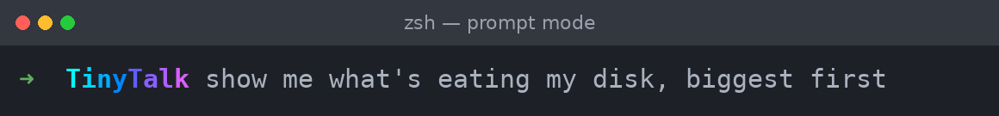

TinyTalk thinks for a moment, then replaces your line with a real command and prints a
one-line explanation beneath it. Read it, edit it if you like, and run it yourself:

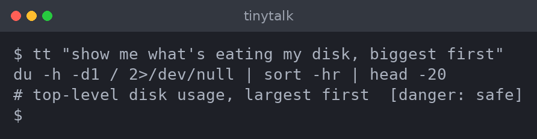

Out of the box the starter config points at a `local` backend. Before it can answer
you'll want either a cloud backend or a local server running — both are covered next.
Not sure which? `tt "list files by size"` from the CLI is the fastest way to confirm
your backend is wired up.

---

## Using a cloud model

The one-stop setup command is `tt auth` — an interactive wizard that picks a provider,
authenticates using that provider's own idiom, tests the credential with one real call,
and writes a validated backend into your config. Secrets go into your OS keychain, never
the config file, and only after you confirm.

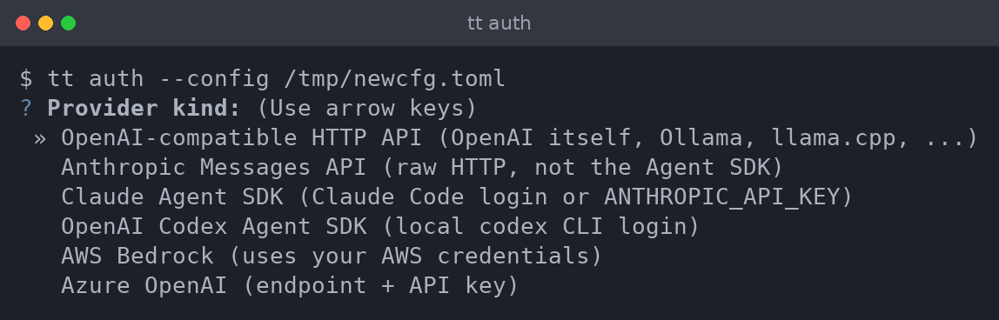

TinyTalk manages exactly two **slots**: a **primary** (asked first) and an optional
**fallback** (used when the primary fails). We'll set up the three most common cloud
backends below. The examples use subscriptions where you already have one, and AWS
Bedrock for a pay-per-token API.

### Claude — with your subscription

If you use Claude Code, TinyTalk can ride the same login: no API key, no separate
billing. First, make sure you're logged in:

```sh
claude      # then /login in the TUI, or:
claude setup-token   # prints a one-year token → export CLAUDE_CODE_OAUTH_TOKEN=...
```

Then run `tt auth`, choose **Claude Agent SDK**, and pick a model. TinyTalk doesn't ask
for a secret here — it uses your existing `claude` login (or `ANTHROPIC_API_KEY` if you'd
rather use a console key).

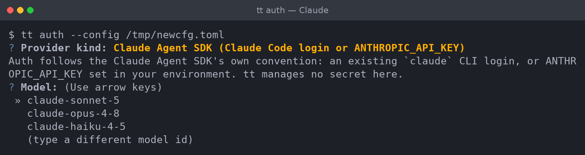

That writes a backend like:

```toml
[defaults]
backend = "claude"

[backends.claude]
kind = "claude-agent-sdk"
model = "claude-sonnet-5"
effort = "low"
```

### Codex — with your ChatGPT plan

Same idea, GPT flavor. Log the Codex CLI in with your ChatGPT plan:

```sh
codex login     # opens a browser for the ChatGPT OAuth flow
```

Then `tt auth` → **OpenAI Codex Agent SDK** → pick a model. TinyTalk rides the local
Codex login; nothing is stored on our side.

```toml
[backends.codex]
kind = "codex-agent-sdk"
model = "gpt-5.5"
effort = "low"
```

### Bedrock — a pay-per-token API

For a plain API key model, AWS Bedrock is the worked example. Two things to do first, in
the AWS console:

1. **Enable model access.** Bedrock → *Model access* → request access to the Anthropic
   models you want. (As of early 2026 these are largely auto-enabled, but a first-time-use
   form may appear.)
2. **Have credentials on the box.** `aws configure` (or SSO/`aws sso login`, or a named
   profile) — TinyTalk uses boto3's normal credential chain.

Then `tt auth` → **AWS Bedrock**. It asks for a region and an optional profile, discovers
the models your credentials can see, and lets you pick one. If discovery comes up empty,
it offers to take an explicit access-key pair instead (stored in your keychain).

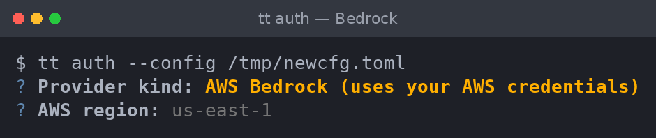

```toml
[backends.bedrock]
kind = "bedrock"
model = "us.anthropic.claude-sonnet-5-v1:0"   # example — use the id tt auth discovers
aws_region = "us-east-1"
```

> Bedrock serves most models through **inference profiles** for on-demand use — if a bare
> model id is rejected, use the profile id `tt auth` discovered (often prefixed with a
> region like `us.` or `global.`).

### Switching and falling back

A primary and a fallback can live in the same config, so you can lean on a local model
and escalate to a cloud one only when it stalls:

```toml
[defaults]
backend = "local"              # primary slot
escalation_backend = "claude"  # fallback slot
```

Run `tt auth` again any time to set up the fallback slot, swap a slot, or remove one.

---

## Using a local model

No cloud, no API key, nothing leaving your machine. TinyTalk talks to any local server
that speaks the OpenAI-compatible HTTP API, which is to say: almost all of them. The two
we'll set up are **oMLX** on macOS (built on Apple's MLX) and **llama.cpp** on Linux —
pick whichever matches your box.

### Choosing a model

The task here is narrow — turn one sentence into one shell command — so you do *not* need
a frontier model. A few things to weigh:

- **Active vs. total parameters.** Mixture-of-Experts (MoE) models list two numbers, e.g.
  *26B-A4B* = 26B total parameters but only ~4B *active* per token. They run at
  small-model speed while carrying big-model knowledge — a sweet spot for this task.
- **Quantization.** 4-bit or 8-bit weights shrink the memory footprint a lot for a small
  quality hit. Quantization-Aware Training (QAT) builds recover most of that loss.
- **Memory.** The quantized weights need to fit in RAM (unified memory on Apple Silicon)
  or VRAM. Leave headroom for the KV cache.
- **Tool-calling / structured output.** Nice to have, not required — TinyTalk degrades to
  a universal fenced-JSON path on any server, so even a bare model works.

Our running example is **Google's Gemma 4 26B-A4B** — the MoE build used in the
[benchmark](#benchmark). It's fast (only ~4B parameters fire per token), fits comfortably
on a modern laptop in a quantized build (~15 GB at QAT Q4), and holds up well on the eval.

### macOS — oMLX

[oMLX](https://github.com/jundot/omlx) is a native Apple-Silicon inference server (OpenAI-
and Anthropic-compatible) with a menu-bar app. Install the CLI via Homebrew:

```sh
brew tap jundot/omlx https://github.com/jundot/omlx
brew install omlx
```

Grab a Gemma 4 MLX build into your model directory — either from the oMLX admin dashboard
(`http://localhost:8000/admin`) or straight from Hugging Face:

```sh
mkdir -p ~/models
hf download unsloth/gemma-4-26b-a4b-it-MLX-8bit \
  --local-dir ~/models/gemma-4-26B-A4B-it-MLX-8bit
```

Serve it. oMLX auto-discovers models from the directory and exposes them at
`http://localhost:8000/v1`:

```sh
omlx serve --model-dir ~/models
```

**Run it as a daemon** so it's up every time you log in. Homebrew's service manager
handles this, with auto-restart on crash:

```sh
brew services start omlx     # start now + at every login
brew services info omlx      # check status
```

By default the service serves from `~/.omlx/models` on port `8000`; set `OMLX_MODEL_DIR`
and `OMLX_PORT` (or run `omlx serve --model-dir …` once to persist settings) to change that.

### Linux — llama.cpp

[llama.cpp](https://github.com/ggml-org/llama.cpp) is the C/C++ engine under much of the
local-LLM world. It loads GGUF weights and its `llama-server` speaks the OpenAI API. The
quickest install is Homebrew (it works on Linux too); otherwise build from source:

```sh
brew install llama.cpp
# or from source:
#   git clone https://github.com/ggml-org/llama.cpp && cd llama.cpp
#   cmake -B build && cmake --build build -j --config Release
```

`llama-server` can pull a GGUF straight from Hugging Face with `-hf`. Point it at a Gemma
4 26B-A4B GGUF (pick a QAT `Q4_K_M` build) and serve on port 8080:

```sh
llama-server -hf unsloth/gemma-4-26b-a4b-it-GGUF:Q4_K_M --port 8080 -c 8192
```

The OpenAI-compatible endpoint is then at `http://localhost:8080/v1`.

**Run it as a daemon** with a systemd *user* service. Create
`~/.config/systemd/user/llama-server.service`:

```ini
[Unit]
Description=llama.cpp server
After=network-online.target

[Service]
ExecStart=%h/.local/bin/llama-server -hf unsloth/gemma-4-26b-a4b-it-GGUF:Q4_K_M --port 8080 -c 8192
Restart=on-failure

[Install]
WantedBy=default.target
```

Then enable it — and `enable-linger` so it starts at boot without you logging in:

```sh
systemctl --user daemon-reload
systemctl --user enable --now llama-server
sudo loginctl enable-linger "$USER"
```

### Point TinyTalk at it

A keyless local server needs no `tt auth` — just an `openai-compat` backend with the
right `base_url`. The installer already scaffolds one; edit it to match your server:

```toml
[defaults]
backend = "local"

[backends.local]
kind = "openai-compat"
base_url = "http://localhost:8000/v1"    # 8080 for llama.cpp
model = "gemma-4-26B-A4B-it-MLX-8bit"
```

Confirm the model is visible (`curl -s localhost:8000/v1/models`), then take it for a
spin. Here's the local model writing a small weather one-liner:

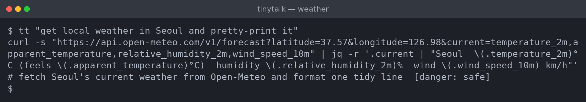

Run the command it gives you, and you get exactly what you asked for — nicely printed:

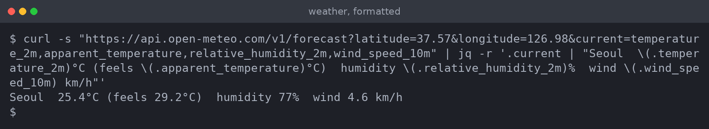

You can inspect the grounding TinyTalk feeds the model at any time:

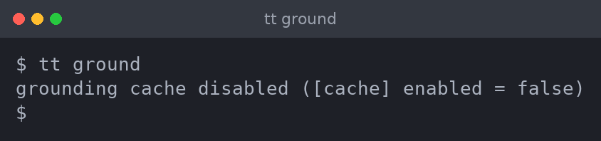

---

## Configuration

Everything lives in `~/.config/tinytalk/config.toml` (override with `--config` or
`TT_CONFIG`). A missing or invalid config fails loudly with a message that says exactly
what to fix. A full-featured example:

```toml
[defaults]
backend = "local"                # the primary slot
escalation_backend = "claude"    # the fallback slot (optional)
posture = "hybrid"               # declared stance: local | hybrid | cloud
language = "ko"                  # explanation language; auto-detected from locale if unset

[backends.local]
kind = "openai-compat"
base_url = "http://localhost:8000/v1"
model = "gemma-4-26B-A4B-it-MLX-8bit"

[backends.claude]
kind = "claude-agent-sdk"
model = "claude-sonnet-5"
effort = "low"                   # reasoning effort: none|minimal|low|medium|high|xhigh|max

[cache]
enabled = true                   # exact-match cache of past prompts

[prices."gemma-4-26B-A4B-it-MLX-8bit"]
input_per_mtok = 0.06            # optional, for the cost column in history & eval
output_per_mtok = 0.33
```

A **backend** is one `[backends.<name>]` table: a `kind` (the wire protocol) plus a model
and any credentials. The available kinds:

| `kind` | What it is |
|---|---|
| `openai-compat` | Any OpenAI-compatible HTTP API — local (oMLX, llama.cpp, Ollama) or hosted |
| `anthropic-compat` | Anthropic Messages API over raw HTTP |
| `claude-agent-sdk` | Claude via the Agent SDK (Claude Code login or `ANTHROPIC_API_KEY`) |
| `codex-agent-sdk` | GPT via the Codex CLI login |
| `bedrock` | AWS Bedrock (uses your AWS credential chain) |
| `azure-openai` | Azure OpenAI (endpoint + API key + deployment) |

A few keys worth knowing: `api_key_env` reads a secret from an environment variable;
`keyring_account` reads it from your OS keychain (this is what `tt auth` sets);
`capabilities` opts a backend into richer response formats (`tool_calling`, `native_json`,
`grammar`); `effort` passes a reasoning-effort level through where the provider supports
it. The **explanation language** (`language`) controls only the one-line explanation — the
command itself and TinyTalk's own messages stay in English.

---

## Features

**Prompt mode & the badge.** Pressing `?` on an empty line toggles prompt mode; the badge
animates a spectrum wave through its letters while you type, and again while TinyTalk
thinks. Press `?` or Backspace on an empty line to leave. The `?` is never inserted as a
literal character when it's toggling the mode.

**Grounding & validation.** Before a request goes out, TinyTalk collects a snapshot of
your system — installed binaries and their key flags, your OS, your shell — and both feeds
it to the model and validates the answer against it. A command that references a binary
you don't have, or that doesn't parse, is rejected rather than shown.

**Danger classification.** Every suggestion is tagged `safe`, `caution`, or `destructive`.
In the widget, a destructive command is inserted **commented out** — you have to
deliberately remove the `#` to run it. No single keystroke can do damage.

**One command, no menu.** The model commits to exactly one answer — no "here are three
options." If it can't produce a valid one, the request fails cleanly instead of guessing.

**Tiers, escalation & cache.** Repeated prompts are served from an exact-match cache for
free. A request can escalate from your primary backend to the fallback when the primary
can't produce a valid command — each tier billed at its own rate.

**History & recall.** Every prompt→command outcome is stored (dated JSONL under
`XDG_STATE_HOME`). `tt history` browses it — an fzf picker when fzf is installed, a plain
listing otherwise. Inside prompt mode, ↑/↓ walk your past commands into the buffer.

**Inspect without spending.** `tt prompt "<request>"` prints the exact system + user
prompt TinyTalk would send — no model call, no cost:

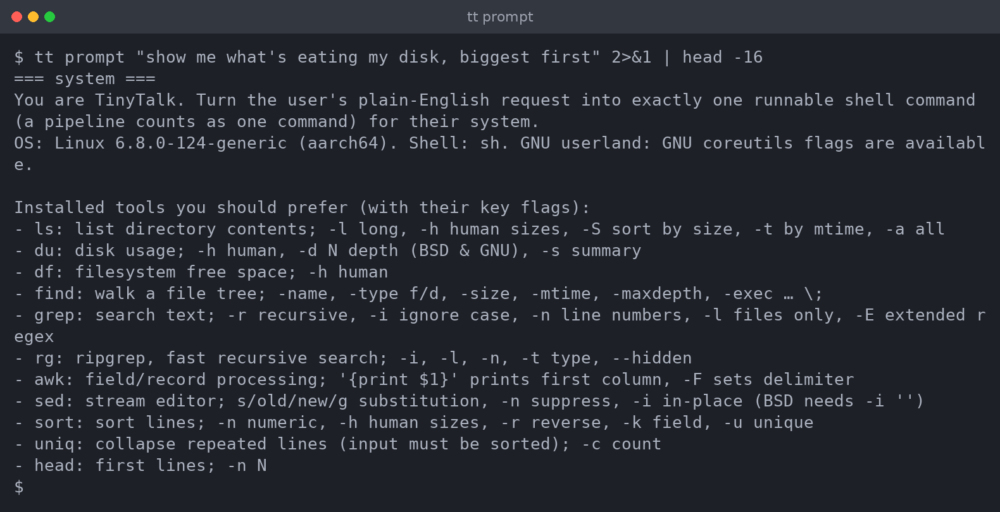

**Script-friendly output.** `tt --json` emits the full structured suggestion for piping
into other tools; `tt --widget` emits the shell-evalable form the zsh integration consumes.

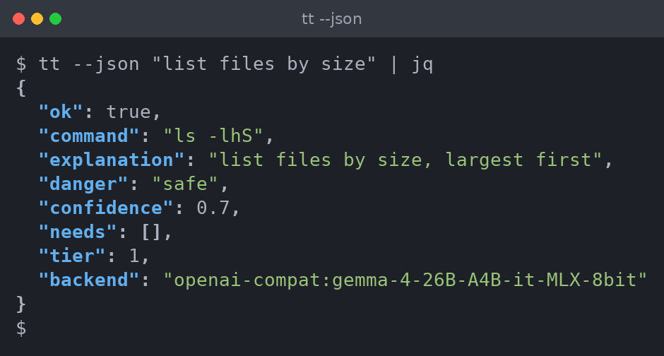

---

## Benchmark

TinyTalk ships its own eval suite. `tt eval` runs a set of natural-language commands
through every configured backend, in both English and Korean, and grades each result on
whether the output actually **parses**, references **real binaries**, and passes its
**assertions** — the metrics that matter for a tool that hands you something to run. Local
models sit right alongside the hosted ones, so you can see exactly what you trade by going
fully offline.

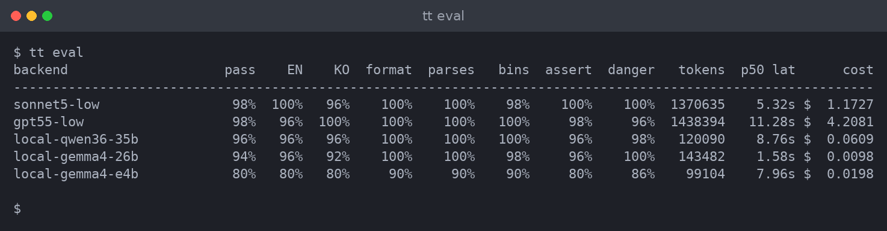

Latest published run: **2026-07-03** ([`docs/bench/2026-07-03/`](docs/bench/2026-07-03/)).

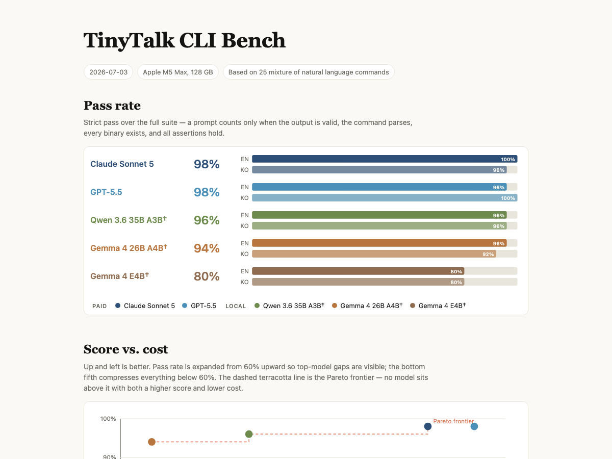

The full interactive report is at [`docs/bench/2026-07-03/index.html`](docs/bench/2026-07-03/index.html),
and [`docs/bench/RUNBOOK.md`](docs/bench/RUNBOOK.md) documents how to reproduce or publish a
run. On the hard 25-target suite, the frontier models (Sonnet 5, GPT-5.5) top out around
98%, with the local **Gemma 4 26B-A4B at 94%** — and notably the *fastest* of the field at
~1.6 s median, for a fraction of a cent per sweep.

### Caveats — read the fine print

A benchmark is a map, not the territory. A few things to keep in mind before you quote a
number:

- **Local costs are equivalents, not bills.** Local models run at ~$0 marginal cost on
  your own machine; the dollar figures are hosted-proxy list rates, shown only to put all
  models on one comparable axis.
- **SDK overhead is counted.** The Claude and Codex backends run through their agent SDKs,
  so each request carries the CLI's own system context (tens of thousands of input tokens)
  and startup latency. That's real overhead of TinyTalk *as shipped* on those backends, so
  it's included — but it inflates their token counts and latency versus a bare API call.
- **Some numbers wobble.** The speculative-decoding local build flips a few prompts between
  temperature-0 runs (± a few points) and reports no cached tokens; tokenizers differ
  (Sonnet's counts ~30% more tokens for the same text). Treat small gaps as noise.
- **"Strict pass" is narrow by design.** A row can carry a transport error yet still
  strict-pass, because the pass is re-scored purely on the returned command's parse /
  binaries / assertions — not on a clean run end to end.

In short: the local models are genuinely competitive for this task, the spread is real,
and the exact decimals are the least interesting part.
